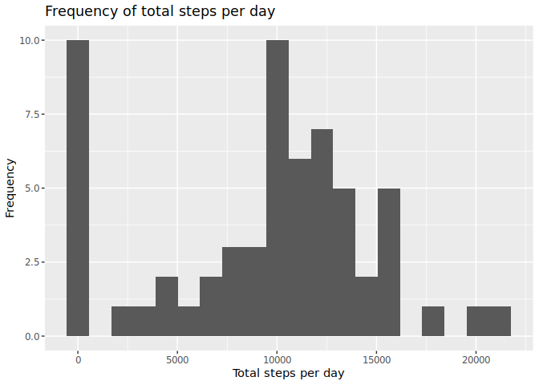

## Loading and preprocessing the data

Download and unzip the data


```r
dir.create("data", showWarnings = FALSE)
download.file("https://d396qusza40orc.cloudfront.net/repdata%2Fdata%2Factivity.zip", "data/activity.zip")
unzip("data/activity.zip", exdir = "data")
```

Load csv into a tibble using readr

```r
tib <- read_csv("data/activity.csv", show_col_types = FALSE)
summary(tib)
```

```
##      steps             date               interval     
##  Min.   :  0.00   Min.   :2012-10-01   Min.   :   0.0  
##  1st Qu.:  0.00   1st Qu.:2012-10-16   1st Qu.: 588.8  
##  Median :  0.00   Median :2012-10-31   Median :1177.5  
##  Mean   : 37.38   Mean   :2012-10-31   Mean   :1177.5  
##  3rd Qu.: 12.00   3rd Qu.:2012-11-15   3rd Qu.:1766.2  
##  Max.   :806.00   Max.   :2012-11-30   Max.   :2355.0  
##  NA's   :2304
```

```r
str(tib)
```

```
## spc_tbl_ [17,568 × 3] (S3: spec_tbl_df/tbl_df/tbl/data.frame)
##  $ steps   : num [1:17568] NA NA NA NA NA NA NA NA NA NA ...
##  $ date    : Date[1:17568], format: "2012-10-01" "2012-10-01" ...
##  $ interval: num [1:17568] 0 5 10 15 20 25 30 35 40 45 ...
##  - attr(*, "spec")=
##   .. cols(
##   ..   steps = col_double(),
##   ..   date = col_date(format = ""),
##   ..   interval = col_double()
##   .. )
##  - attr(*, "problems")=<externalptr>
```

## What is mean total number of steps taken per day?


```r
total <- tib %>%
    group_by(date) %>%
    summarise(sum = sum(steps, na.rm=TRUE))

ggplot(total, aes(sum)) +
    geom_histogram(bins=20) +
    ggtitle("Frequency of total steps per day") +
    labs(x = "Total steps per day", y = "Frequency")
```

<!-- -->

The mean number of total steps per day is


```r
mean(total$sum)
```

```
## [1] 9354.23
```
The  median number of total steps per day is

```r
median(total$sum)
```

```
## [1] 10395
```
## What is the average daily activity pattern?


```r
avg <- tib %>%
    group_by(interval) %>%
    summarise(steps = mean(steps, na.rm=TRUE))

ggplot(avg, aes(interval, steps)) +
    geom_line() +
    labs(x = "Interval", y = "Average number of steps") +
    ggtitle("Average number of steps per interval")
```

<!-- -->

Interval with maximum number of steps


```r
avg[which.max(avg$steps),1]
```

```
## # A tibble: 1 × 1
##   interval
##      <dbl>
## 1      835
```
## Imputing missing values

Total number of missing values in the dataset


```r
sapply(tib, function(x) sum(is.na(x)))
```

```
##    steps     date interval 
##     2304        0        0
```
Only missing values in steps, so there are 2304 total NA values.

To fill in these missing values replace NAs with the mean steps taken in that interval between all days.


```r
filled <- tib %>% mutate(steps = ifelse(is.na(steps), 
                                        round(avg$steps[match(interval, avg$interval)]),
                                        steps))
```

```r
total_filled <- filled %>%
    group_by(date) %>%
    summarise(sum = sum(steps, na.rm=TRUE))

ggplot(total_filled, aes(sum)) +
    geom_histogram(bins=20) +
    ggtitle("Frequency of total steps per day") +
    labs(x = "Total steps per day", y = "Frequency")
```

<!-- -->
The new mean number of total steps per day is


```r
mean(total_filled$sum)
```

```
## [1] 10765.64
```

The new median number of total steps per day is


```r
median(total_filled$sum)
```

```
## [1] 10762
```

The mean and median have both slightly increased because of this imputing technique, but it isn't an extreme amount due to relying on average values from other days.

## Are there differences in activity patterns between weekdays and weekends?

Add new column with boolean stating if row is on a weekend/not.


```r
filled <- filled %>% mutate(weekend = weekdays(date) %in% c("Saturday", "Sunday"))
```

Group by this new column and plot the avg steps per interval.


```r
grouped <- filled %>%
    group_by(weekend, interval) %>%
    summarise(steps = mean(steps))
```

```
## `summarise()` has grouped output by 'weekend'. You can override using the
## `.groups` argument.
```

```r
ggplot(grouped, aes(interval, steps)) +
    facet_grid(weekend ~ ., labeller=as_labeller(c(`TRUE` = "Weekend",
                                                   `FALSE` = "Weekday"))) +
    geom_line() +
    labs(x = "Interval", y = "Average number of steps") +
    ggtitle("Average number of steps per interval on weekends/days")
```

<!-- -->
